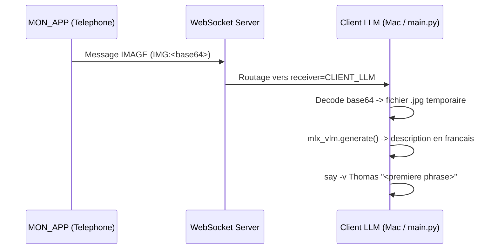
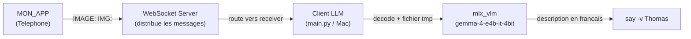

# Architecture

## Flux de traitement d'image

### Séquence

```mermaid
sequenceDiagram
    participant Phone as MON_APP (Telephone)
    participant Server as WebSocket Server
    participant LLM as Client LLM (Mac / main.py)

    Phone->>Server: Message IMAGE (IMG:<base64>)
    Server->>LLM: Routage vers receiver=CLIENT_LLM
    LLM->>LLM: Decode base64 -> fichier .jpg temporaire
    LLM->>LLM: mlx_vlm.generate() -> description en francais
    LLM->>LLM: say -v Thomas "<premiere phrase>"
```

### Architecture statique

```mermaid
flowchart LR
    Phone["MON_APP\n(Telephone)"]
    Server["WebSocket Server\n(distribue les messages)"]
    LLM["Client LLM\n(main.py / Mac)"]
    MLX["mlx_vlm\ngemma-4-e4b-it-4bit"]
    Say["say -v Thomas"]

    Phone -- "IMAGE: IMG:<base64>" --> Server
    Server -- "route vers receiver" --> LLM
    LLM -- "decode + fichier tmp" --> MLX
    MLX -- "description en francais" --> Say
```
